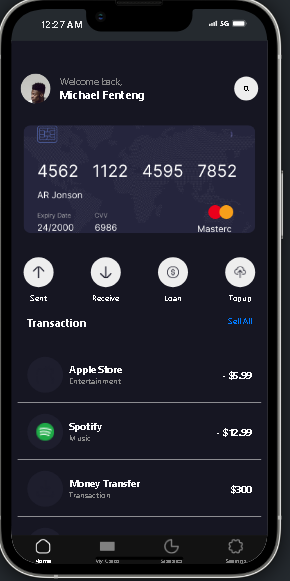
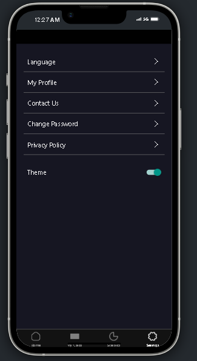

# rn-assignment5-11210750

This application was built as a part of a React Native learning assignment. The goal was to create a mobile app that demonstrates the use of various React Native components and concepts, including navigation, state management, and API integration.

## How I Built This Application

The development process involved several key steps:

1. **SettingScreen**: This setup suggests that the SettingsScreen component is designed to display and manage various settings options for the application, likely including theme toggling and navigation to different settings-related screens or functionalities.

2. **homeScreen**: This excerpt from the HomeScreen.jsx file defines a portion of an array of objects, each representing a different item, likely for display in a UI component of a React Native application. Each object contains several properties:

id: A unique identifier for the item.
name: The name of the item, such as "Apple", "Spotify", or "Money Transfer".

category: The category to which the item belongs, e.g., "Music" or "Transaction".

amount: A string that represents an amount of money associated with the item. This could be an expense (indicated by a negative value like "- $12.99") or income (indicated by a positive value like "$300").

3. **Navigation**: Implemented stack navigation and tab navigation using React Navigation to allow users to navigate through different screens.

## Screenshots

Below are some screenshots of the app showcasing its features and UI:

*Home Screen*

*Settings Screen*

